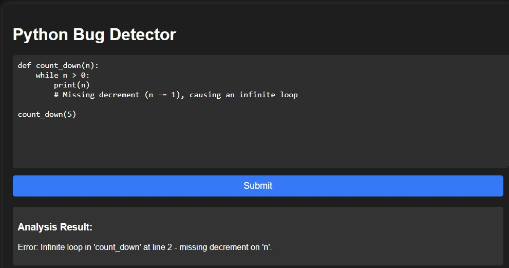

# 🛠️ TheCodeMind  

## 📝 Note  
**This file documents only the features implemented so far.Focusing on one program language(Python)**  

## 📝 Overview  
A **real-time Python bug detection tool** using **Flask & Gemini AI**, designed to **analyze AST JSON and detect logical & syntax errors with precision**.  

##  Problem  
 **Manual debugging is slow, error-prone, and inefficient.**  
- Developers struggle with **hidden logical flaws, infinite loops, and undefined variables** that traditional linters miss.
- The current version supports **manual logical and syntatic bug detection** through a separate UI.    


##  Solution  
⚡ **AI-driven detection system.**  
- **Analyzes code**, ensuring minimal processing overhead.  
- Detects **critical logic issues instantly**, including **unreachable code, faulty loops, and incorrect conditionals**.  
- Provides **actionable, pinpointed error reports**, making debugging **faster & more efficient**.  

## 🎯 Key Features  
-  **AST-based analysis** to detect logic & syntax issues.  
-  **Flask-powered API** for real-time bug detection.  
-  **Gemini AI integration** for advanced error detection.  
-  **Minimal false positives**, ensuring high accuracy.  
-  **Basic UI** for an intuitive debugging experience.  
-  **User enters a valid Gemini API key in the UI** for secure AI access.  

## 🚀 Future Enhancements  
🚧 The current version supports **manual bug detection** when the user submits the code. Future versions will:  
- Enable **real-time error detection** while typing.  
- Support **multiple programming languages** beyond Python.  
- **VS Code Extension** for real-time error detection directly in the editor.  

## 🛠️ Tech Stack  
- **Backend:** Flask, Python  
- **AI Model:** Gemini AI (Google Generative AI)  
- **Frontend:** HTML, CSS, JavaScript  
- **Data Processing:** Abstract Syntax Tree (AST)  

## 📂 Folder Structure  
```
📦 AI-Bug-Detector
 ┣ 📂 config           # Configuration files
 ┣ 📂 templates        # HTML templates
 ┣ 📂 api              # Flask-based API
 ┣ 📜 app.py           # Main backend logic
 ┣ 📜 requirements.txt # Dependencies
 ┣ 📜 main.py          # Sends Python code to a Flask backend for AST analysis.
 ┣ 📜 README.md        # Project documentation
```

## 🚀 Installation & Setup  
1️⃣ **Clone the repository**  
```bash
git clone https://github.com/keerthana2-005/TheCodeMind.git
cd "Bug Detector"
```

2️⃣ **Install dependencies**  
```bash
pip install -r requirements.txt
```

3️⃣ **Run the application**  
```bash
python app.py
```

4️⃣ **Access the UI**  
- Open `http://localhost:5001` in your browser.  
- Enter a valid **Gemini API key** .  

## 🛠️ How It Works  
1️⃣ **Write or update Python code in the editor.**  
2️⃣ **Click 'Analyze'** – The updated AST is sent to Gemini AI.  
3️⃣ **Get instant, precise error messages** with issue location.  
4️⃣ **Fix the bugs & improve your code quality effortlessly!**  

## 🎯 Why This Project?  
- **Enhances developer productivity** 🚀  
- **Reduces debugging time significantly** ⏳  
- **Automates logic error detection** 🤖  
- **Ensures cleaner, high-quality code** ✅
- 


## 📬 Contact  
For queries or collaborations, reach out at [keerthisvc14@gmail.com].  
